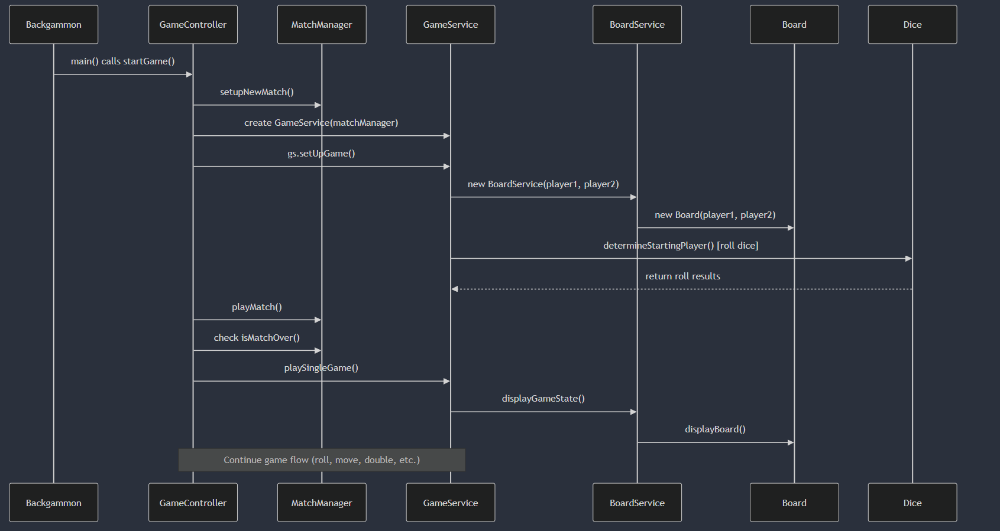
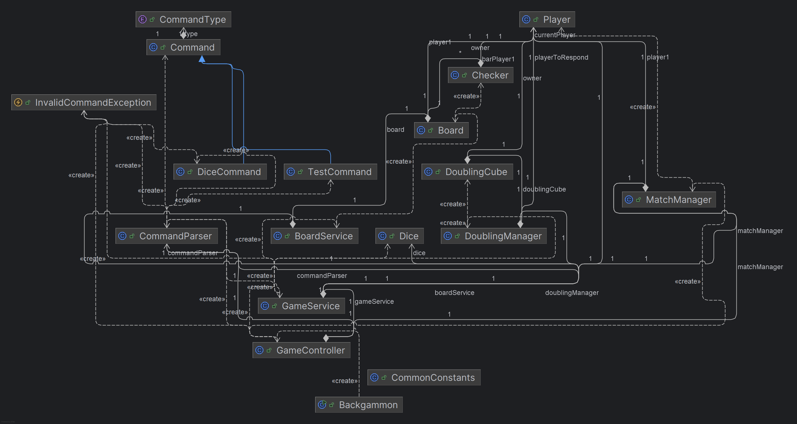

# Group 5 - Dice Bros: Backgammon
Backgammom Developed as part of Group Project for COMP41670: Software Engineering module.

## Sequence Diagram

## Class Diagram:

## Test Commands:

**Test using file**

Usage: 
test \<filename>

Example:
test src/test/resources/commands.txt

**Set Next Dice to specific values**

Usage:
dice \<int> \<int>

Example:
dice 5 6
